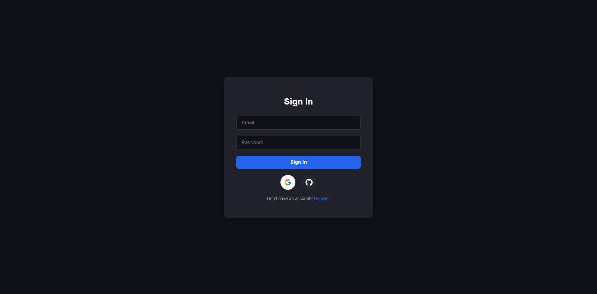
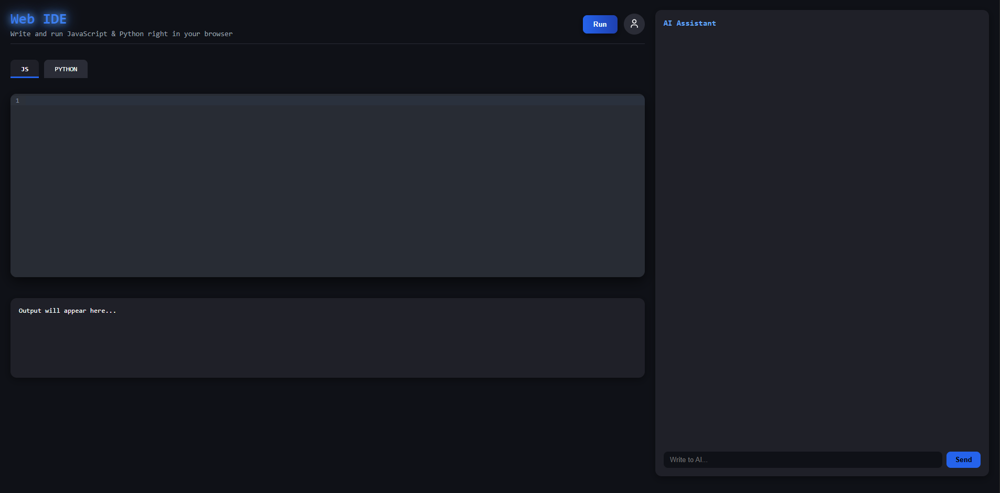
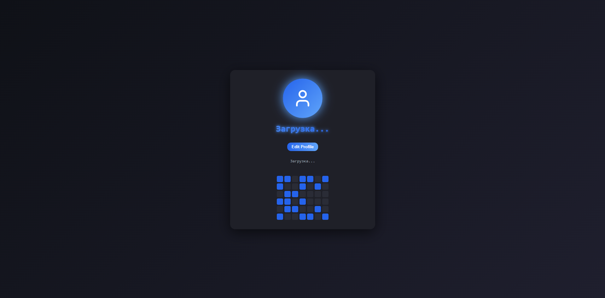
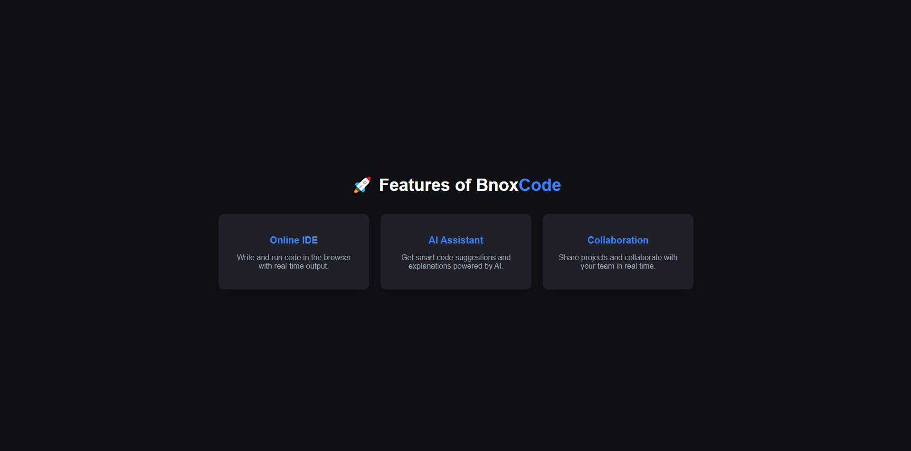
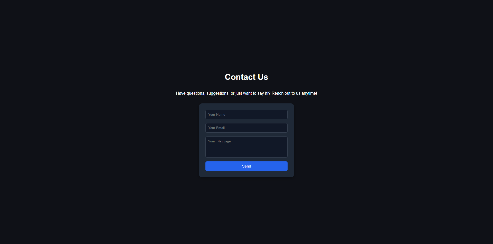

<h1 align="center" style="display: block; font-size: 2.5em; font-weight: bold; margin-block-start: 1em; margin-block-end: 1em;">
  
    
  <strong>WEB IDE</strong>
</h1>

  <em>BnoxCode — это веб-сервис, где можно писать и запускать код на <b>JavaScript</b> и <b>Python</b> прямо в браузере, 
  а также получать помощь от встроенного <b>AI-ассистента</b>.</em>

## 📑 Содержание
- [⚡️ Быстрый старт](#-быстрый-старт)
- [🐳 Докер](#-докер)
- [🛠 Стек технологий](#-стек-технологий)
- [🚀 Функциональность](#-функциональность)
- [📸 Скриншоты](#-скриншоты)
- [📂 Архитектура проекта](#-архитектура-проекта)

## ⚡️ Быстрый старт

## 🐳 Докер

## 🛠 Стек технологий

| Категория   | Технологии |
|-------------|------------|
| **Backend** |     |
| **Frontend** |  |
| **Infra**   |  |
| **AI**      |  |

## 🚀 Функциональность

- ✅ **Онлайн-редактор кода**  
  Поддержка **JavaScript** и **Python** с удобной подсветкой синтаксиса прямо в браузере.  

- ✅ **Запуск в изолированных контейнерах**  
  Код каждого пользователя выполняется безопасно и независимо, без риска «сломать» общий сервер.  

- ✅ **Подсветка синтаксиса и автодополнение**  
  Удобное редактирование кода благодаря современному редактору с подсказками.  

- ✅ **Авторизация и управление пользователями**  
  Поддержка входа через **GitHub OAuth2** или JWT-токены.  

- ✅ **AI-ассистент (GigaChat)**  
  Встроенный помощник на базе ИИ, который помогает писать и отлаживать код, объясняет ошибки и предлагает улучшения.

## 📸 Скриншоты

  
   <em>Авторизация через GitHub OAuth2</em>

  
   <em>Онлайн-редактор с подсветкой синтаксиса и запуском кода</em>

  
   <em>Профиль пользователя с историей кода и настройками</em>

  
   <em>Раздел «Функциональность» — демонстрация всех ключевых возможностей веб-IDE и AI-ассистента</em>

  
   <em>Раздел «Контакты» — пользователи могут отправлять сообщения или обратную связь через веб-форму</em>

## 📂 Архитектура проекта
