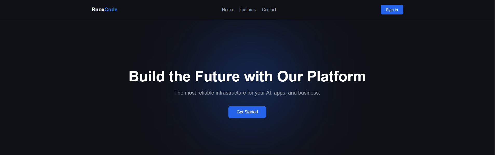

<h1 align="center" style="display: block; font-size: 2.5em; font-weight: bold; margin-block-start: 1em; margin-block-end: 1em;">

    <strong>WEB IDE</strong>
</h1>

*BnoxCode - это веб-сервис, где можно писать и запускать код на **javascript**  и **python** прямо в браузере, а также получать помощь от встроенного **AI-ассистента*.**
